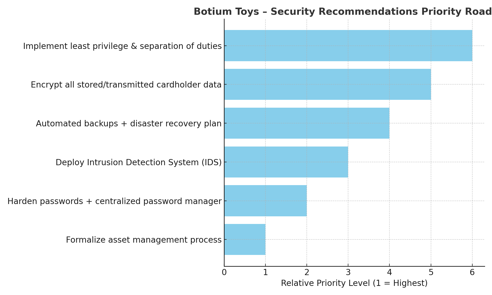

# Botium Toys — Security Audit (Mock Project)

**Overview:**  
This is a mock security audit of Botium Toys, a fictional toy retailer with both an online and physical presence.  
The project applies the **NIST Cybersecurity Framework (CSF)** to assess the company’s assets, existing controls, and compliance posture, and provides prioritized recommendations for remediation.

---

## Scope & Methodology
- **Scope:**  
  Organization-wide review, including:
  - On-premises and remote employee devices
  - Internal network and internet-facing systems
  - Ecommerce, accounting, inventory, and database systems
  - Data storage and retention
  - Legacy system maintenance

- **Method:**  
  - Asset inventory and classification  
  - Control and compliance checklist review  
  - Gap analysis against NIST CSF functions (Identify, Protect, Detect, Respond, Recover)  
  - Risk scoring (1–10) based on potential business impact  

---

## Key Findings
- All employees have access to sensitive customer data (cardholder, PII/SPII).
- No encryption for stored or transmitted cardholder data.
- Lack of **least privilege** and separation of duties.
- No Intrusion Detection System (IDS) in place.
- No backups or formal disaster recovery plan.
- Weak password policy; no centralized password manager.
- Legacy systems maintained without a formal schedule.
- **Risk score:** **8/10** — high exposure due to control and compliance gaps.

**Positives:**
- Firewall with defined security rules.
- Antivirus software installed and monitored.
- Breach notification process for EU customers in place.

---

## Prioritized Recommendations

1. **Implement least privilege & separation of duties** — Limit access to sensitive data only to necessary roles.
2. **Encrypt all cardholder data** — Apply encryption for both data at rest and in transit (PCI DSS alignment).
3. **Automated backups + disaster recovery plan** — Ensure business continuity during disruptions.
4. **Deploy IDS** — Monitor and alert on suspicious activity.
5. **Harden password policies** — Modern complexity standards + centralized password management tool.
6. **Formalize asset management** — Maintain an accurate, up-to-date inventory.

---

## Files in this Repository
- [`docs/Botium_Toys_Security_Audit.pdf`](docs/Botium_Toys_Security_Audit.pdf) — Full audit report
- [`assets/botium_toys_priority_roadmap.png`](assets/botium_toys_priority_roadmap.png) — Recommendations priority roadmap

---

## Skills Demonstrated
- Cybersecurity risk assessment
- NIST CSF application
- Compliance analysis (PCI DSS, data privacy)
- Control design and recommendations
- Executive-ready reporting
- Visual communication of priorities

---

**Note:** This is a fictional case study created for portfolio purposes.
